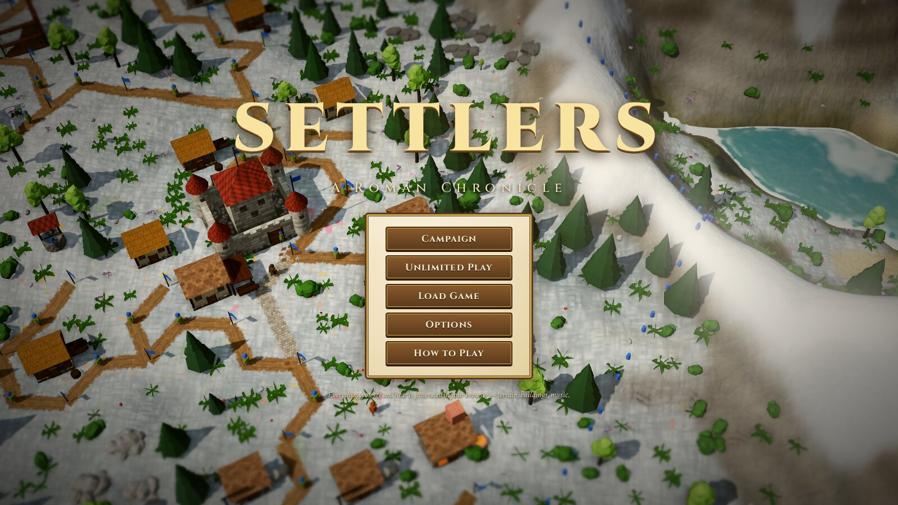
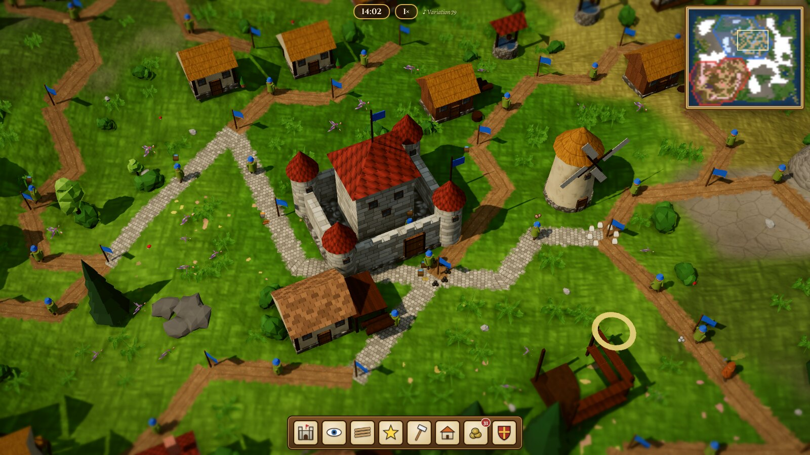
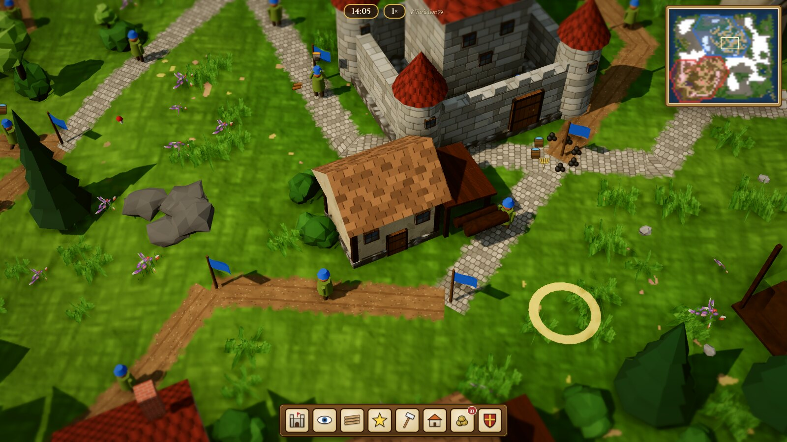
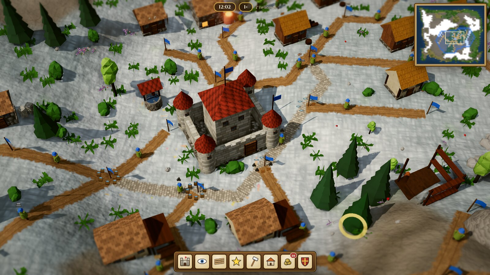
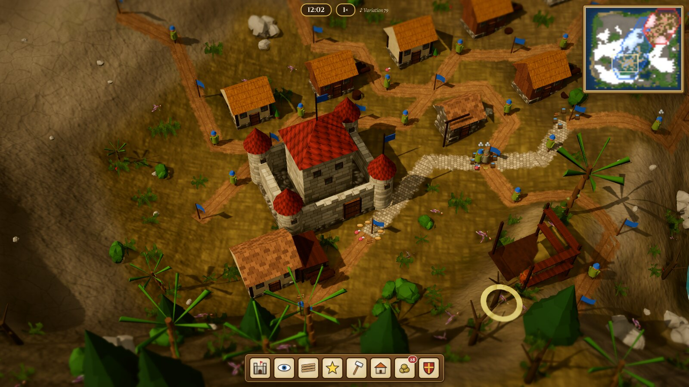
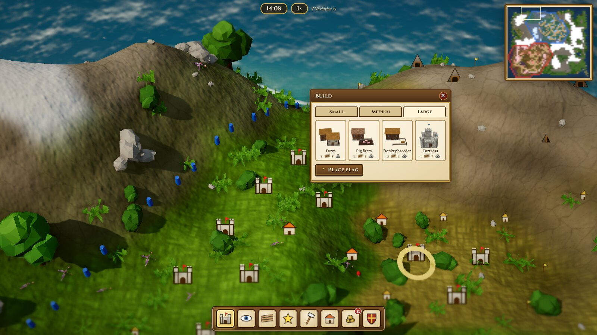
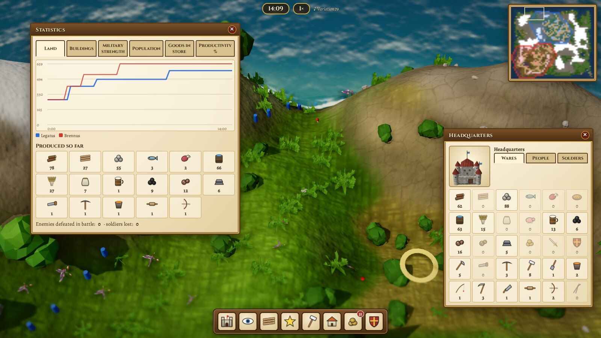
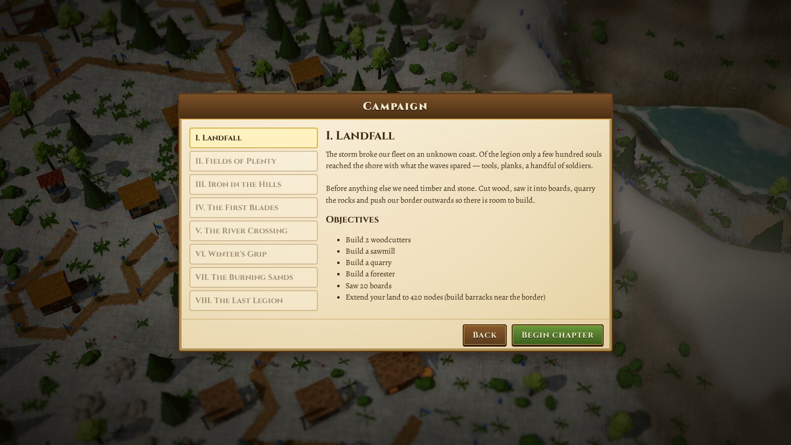

# Settlers — A Roman Chronicle

A browser strategy game in the spirit of **The Settlers II Gold**, built with three.js. Every ware is carried by hand from flag to flag, every worker needs a tool, and the land only grows as far as your soldiers can hold it.

**Nothing is downloaded but code.** Terrain, buildings, settlers, textures, icons, sound effects and music are all generated in your browser at startup. There are no image or audio files in this repository apart from the README screenshots.



## Screenshots

| | |
|---|---|
|  |  |
| **Greenland** — roads, flags, carriers, and cobbled roads where traffic is heavy | **Close-up** — every settler is animated and carries a real ware |
|  |  |
| **Winter world** | **Wasteland** |
|  |  |
| **Build menu** — small / medium / large / mine tabs and the build-help overlay (Space) | **Windows** — statistics per player, warehouse stock, workers, soldiers |



## Play

**Online:** https://www.genhttp.dev/lambda/settlers-roman-chronicle/ opens on the multiplayer lobby. Single player and the campaign are one click away.

### Locally, single player

It's a static site with no build step. Serve the folder over HTTP (ES modules don't load from `file://`):

```bash
git clone https://github.com/markldn/settlers-roman-chronicle.git
cd settlers-roman-chronicle
./run.sh            # python3 http.server on 0.0.0.0:8960
# open http://localhost:8960/  (or http://<your-lan-ip>:8960/ from another machine)
```

Any static server works (`npx serve`, nginx, and so on). It needs a WebGL2 browser. Chrome, Edge and Firefox on a desktop GPU are recommended. If frames drop, set **Options → Graphics quality** to Medium or Low.

### Locally, with multiplayer

Multiplayer needs the small server in `server/` (C#, [GenHTTP](https://genhttp.org)). To run it on your machine you need Node 22 and the .NET 10 SDK:

```bash
npm install
npm run build        # bundles the game into dist/ (one minified script)
npm run dev-server   # hosts server/ + dist/ on http://localhost:8961/
```

### Publishing

The hosted version is a lambda on [genhttp.dev](https://www.genhttp.dev/). `npm run deploy` builds the game and uploads the server code plus `dist/` as a new version. It reads the lambda's editor key from `$GENHTTP_KEY` or from the git-ignored file `.genhttp-key`. The key grants write access to the lambda, so never commit it.

## Multiplayer

The site opens on the multiplayer lobby, over a live game of two computer players. **Single player & campaign** at the bottom leads to the classic menu (campaign, unlimited play, saved games).

- **An assistant guides you in.** It asks for your name the first time, then whether you want to join a game or host one. Hosting takes four short steps: world size, landscape and layout, computer opponents (how many, how well they play, allied or not), and a name for the game. Your choices are remembered for next time.
- **The room.** It shows the players and their seats, a summary of the settings and a **Copy invite link** button. The link (`…/#join=<room>`) brings a friend straight into this room. Each player picks their nation and optionally a team (teammates cannot attack each other), and marks themselves ready. The host can open **Change settings** for everything else (mountains, forests, water, starting goods, seed) and starts the game. You can also start alone against the computer. Games still gathering players are listed in the lobby, with a lobby chat beside them.
- **In the game.** Press `Enter` to chat with the other players. The panel at the top left lists the realms. Only the host sets the speed or pauses (`+` `-` `P`). The game menu does not pause a multiplayer game. You can save a copy, which loads as a single-player game.
- **Dropping out.** If your connection breaks, the page reconnects by itself and catches up. If you reload or come back to the site within a few minutes, you are put back in your seat without any clicks. While a player is away for more than 20 seconds, a computer steward runs their realm until they return. A player who leaves the game for good is replaced by the computer. If the server forgets the game (it restarted), you can keep playing alone and the computer takes over the other realms.

### How it works

The server never runs the simulation. It is a **turn clock**: every 100 ms it closes a turn, which holds the commands players sent since the last turn plus how many simulation ticks the turn lasts (2 at normal speed, 0 while paused). It sends the turn to every player. Each browser runs the same deterministic simulation (seeded RNG, fixed 20 Hz ticks, integer grid), applies the same commands at the start of the same turn and so computes the same game (**lockstep**). A command travels as plain JSON such as `{k: 'build', n: 1234, t: 'sawmill'}`. Every client validates it in `src/sim/commands.js`, so a player can only change their own realm.

- Every 20 turns each browser sends a fingerprint of its state. If one differs from the host's, the host uploads a snapshot, everybody loads it, and they replay the turns since then.
- The host uploads a snapshot every 30 seconds anyway, gzipped and usually under 100 KB. A player who rejoins loads the latest snapshot and replays at most 30 seconds of turns.
- Single player uses the same command path, applied at once. The UI does not know which mode it runs in.

## What's in it

### Economy, as in Settlers II
- **Hex node grid.** Buildings stand on a node with their flag on the south-east neighbour. Each node fits a flag, a small, medium or large house, or a mine, depending on terrain, slope and neighbours.
- **Roads between flags, one carrier per segment.** Flags hold up to 8 wares. Put more flags on a road to get more carriers and faster transport. Busy roads turn to cobblestone and get a donkey.
- **31 buildings and 30 wares** in the classic chains:
  - Wood → sawmill → boards, with a forester to replant. A quarry or granite mine for stone.
  - Grain + water → flour → bread. Fish, game and pigs also give food, and food feeds the mines.
  - Coal and iron ore → iron. Iron + boards → tools. Iron + coal → swords and shields. Gold + coal → coins. Grain + water → beer.
- **Tools make workers.** A helper becomes a woodcutter only when there is an axe in stock. The metalworks makes whatever tool is missing, then follows your priority sliders.
- **Transport priority, tool priority and military settings** match S2's economy windows.
- **Geologists** search mountains and leave signs for coal, iron, gold and granite. Mines run out.

### Land and war
- Occupied military buildings (barracks, guardhouse, watchtower, fortress) claim territory. Border stones mark the edge.
- Soldiers are recruited from a helper, a sword, a shield and a beer. They have 5 ranks and are promoted with gold coins.
- Attack enemy buildings in range. Defenders come out one at a time and fight 1-on-1 at the flag. A conquered building flips its land, and enemy buildings left on your land burn.
- Catapults, lookout towers and scouts, plus fog of war.

### Computer opponents
Easy, normal and hard AIs build a full economy, keep their roads short, expand toward resources and enemies, and attack when they are stronger.

### Campaign and unlimited play
- **8-chapter Roman campaign.** The story and maps are original. It goes from *Landfall* to *The Last Legion* against three allied kings, with objectives, briefings and tutorial hints.
- **Unlimited play.** Pick the map size (up to 144×128), the landscape (greenland, winter, wasteland), the layout (continent, lakes, river valley, islands, mountain pass), up to 5 opponents, alliances, starting goods and a seed.
- Save and load (gzip-compressed in localStorage), plus F5/F9 quick save and load.

### Graphics
- **Terrain.** A smoothed heightfield with a procedural splat texture baked once on the GPU: grass blades, rock strata and cracks, sand ripples, snow and swamp, with organic blends between terrain types. It adds slope-based rock, darker valleys, wet shorelines and drifting cloud shadows.
- **Water.** Depth-based colour, animated normals, fresnel sky reflection, sun glints and shoreline foam.
- **Buildings.** Procedural models built from a generated material atlas (plaster, stone, tiles, thatch, timber and more) with a derived normal map. Each nation has its own palette, and team-coloured banners wave. Construction rises out of scaffolding with material piles next to it. Buildings burn and collapse, and windmills turn.
- **Everything else is instanced.** Settlers are animated body-part meshes with tools and poses (walk, chop, hammer, scythe, fish, fight, carry overhead). There are deer, rabbits, foxes and ducks, trees that sway in the wind and fall when cut, fields that ripen, and smoke, fire, sparks and dust.
- **Post-processing.** Soft shadows, GTAO ambient occlusion, bloom, colour grading, vignette and a subtle tilt-shift.

### Sound
All sound is synthesized with the Web Audio API. Sound effects are rendered once offline: axes, saws, hammers, pickaxes, anvils, falling trees, splashes, bows, sword clashes, war horns and fanfares. They play positionally relative to the camera. Ambience (birds, wind and surf) follows what you are looking at. The music is a scheduled medieval ensemble of lute, recorder, bowed drone, pad and frame drum. It plays four composed themes plus seeded variations, and switches to a march when fighting is near.

## Controls

| Input | Action |
|---|---|
| Left click | Build menu on your land · open a building / flag / road |
| Right-drag / `WASD` / arrows | Scroll |
| Mouse wheel / `PgUp` `PgDn` | Zoom |
| Middle-drag / `Q` `R` | Rotate |
| `Space` | Build help (what fits where) |
| `H` | Jump to headquarters |
| `I` `T` `E` `B` `N` | Inventory, statistics, economy settings, buildings, messages |
| `+` `-` · `P` | Game speed · pause |
| `F5` / `F9` | Quick save / quick load |
| `Enter` | Multiplayer: chat with the other players |
| `Esc` | Cancel road · close windows · game menu |

After you place a building you are in **road mode** straight away. Click nodes to lay the road and finish on a flag. Click the last node again to end with a new flag.

## Code layout

```
src/sim/        pure-JS simulation (no DOM): runs in the browser and headless in node
  data.js       buildings, wares, jobs, ranks, nations: all balance lives here
  grid.js       hex grid geometry, seeded RNG, binary heap, noise
  mapgen.js     procedural maps, resources, start positions (with carved valleys)
  logistics.js  road validation, flag-graph routing (next-hop tables), request dispatch
  jobs.js       settler state machines: carriers, builders, gatherers, producers, geologists
  military.js   territory, garrisons, promotions, attacks, combat, catapults
  ai.js         computer opponents
  missions.js   campaign chapters and objectives
  game.js       state, commands, fixed 20 Hz update, save/load
src/render/     three.js: terrain bake + water, models, instanced world sync, icons, post
  commands.js   every player command (validated) + the state fingerprint used by multiplayer
src/net/        multiplayer client: websocket with reconnect (net.js), lockstep turn runner (lockstep.js)
src/ui/ui.js    windows, build menu, road building, minimap, input
src/ui/lobby.js front page: multiplayer lobby + host assistant, game room, in-game chat and player list
src/audio.js    synthesized SFX, ambience and music
server/         the multiplayer server (C#, a genhttp.dev lambda): lobby, rooms, chat, turn clock, snapshots
tools/          build (esbuild bundle), local dev server, deploy
vendor/three/   three.js r185 (MIT), vendored so the game works offline
tests/          headless soak test + Playwright browser probes
```

## Tests

```bash
node tests/sim.test.mjs 30 5   # 2 hard AIs for 30 game-minutes: invariants, economy, combat, save/load
./run.sh & node tests/play.mjs # browser: builds through the real UI, runs time, opens windows, save/load
node tests/shots.mjs           # regenerates the README screenshots
node tests/mp.test.mjs         # lockstep: 3 clients + same commands stay identical; snapshots; command validation
URL=http://localhost:8961/ node tests/mp-browser.mjs   # two browsers: lobby, chat, room, game, rejoin (needs the dev server)
```

The headless sim runs about 400× realtime. The browser probes need Playwright and a GPU. They launch Chromium with `--use-angle=vulkan`.

## Credits and license

The game code is under the MIT license (see `LICENSE`). three.js is © three.js authors, under the MIT license (`vendor/three/LICENSE`). Fonts are Cinzel and Alegreya, loaded from Google Fonts (SIL OFL), with serif fallbacks when offline.

This is a fan-made tribute and is not affiliated with Ubisoft or Blue Byte. *The Settlers* is their trademark. The repository contains none of the original game's assets, story or maps.
